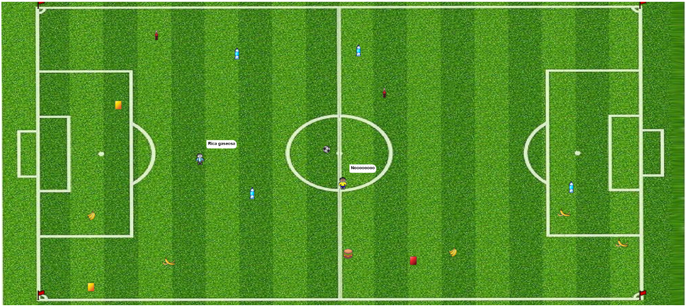

#  Fulbot

UTN - Facultad Regional Buenos Aires - Materia Paradigmas de Programación

## Equipo de desarrollo: 

- Alí Isi
- Facundo Soca
- Francisco Bossi
- Franco Gegon
- Martín Friedrich

## Capturas 

## Reglas de Juego / Instrucciones

Cada jugador debe desplazarse por el campo de juego tratando de recolectar consumibles en el camino
para no cansarse, y patear la pelota hacia el arco rival. El que hace más goles gana!

Notas importantes:
- Los goles solo cuentan cuando la pelota es pateada dentro del arco, no se puede anotar dribbleando.
- La partida finaliza cuando algún jugador llega a anotar 3 goles.

## Controles:

- `W` para mover el jugador 1 hacia arriba.
- `A` para mover el jugador 1 hacia abajo
- `S` para mover el jugador 1 hacia la izquierda.
- `D` para mover el jugador 1 hacia la derecha.
- `SPACEBAR` para patear la pelota.
  
- `UP` para mover el jugador 2 hacia arriba.
- `DOWN` para mover el jugador 2 hacia abajo.
- `LEFT` para mover el jugador 2 hacia la izquierda.
- `RIGHT` para mover el jugador 2 hacia la derecha.
- `DELETE` para patear la pelota.

## Relaciones del juego con la materia y aclaraciones 

En el desarrollo de este juego hicimos uso de tópicos vistos en la materia, y especialmente en el paradigma orientado a objetos.
Entre ellos podemos encontrar el uso de clases y herencias para los ítem que se ven el juego. Usando herencias, pudimos a partir de una clase de Ítem, generar las distintas clases de consumibles tanto los de comida, como los que modifican el desplazamiento.
Utilizamos a su vez el polimorfismo, ya que logramos que todos los Items que reciben el mensaje que realiza los efectos al jugador, genere en el mismo un efecto diferente dependiendo del consumible. 
Finalmente, utilizamos Wollok Game para realizar todos los ajustes relacionados tanto con la interfaz del juego como con ciertas acciones de los objetos. Como es el caso del desplazamiento, de los lapsos de tiempo en que se realizan acciones, entre otros. Finalmente aclaramos que a pesar de que Wollok cuenta con una función especial para las colisiones, nuestro juego utiliza mucho el cambio de velocidad en los movimientos del jugador, desplazándose de a una celda, de a dos, o incluso tres. Con esto en mente al utilizar las colisiones se requería que el objeto esté posicionado exactamente en la celda, lo que en la mayoría de los casos complicaba el agarre de los mismos y la experiencia del juego. Es por eso que optamos por el uso de algunas ecuaciones de distancia para calcular proximidades y así poder realizar "agarres" de items que estén a un rango de cercanía del jugador. 
